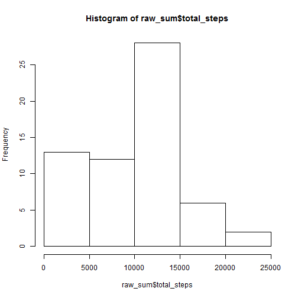
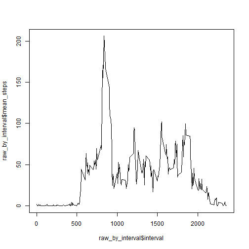
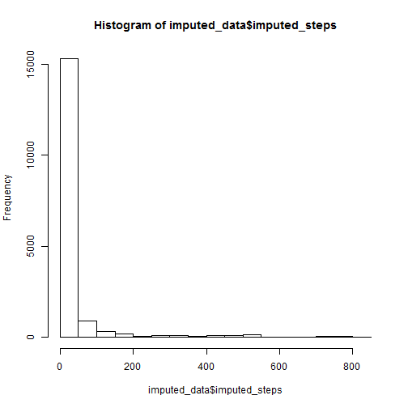
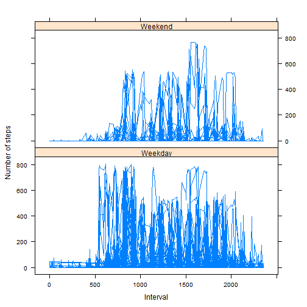

# Peer Assignment 1, Reproducible Research
Author: Sachin Sangtani
Created on: Oct 19, 2015


## Loading and preprocessing the data

Loading the required libraries and reading the raw data


```r
library(data.table)
library(lattice)

activity_data <- data.table(read.csv("activity.csv"))
```

## What is mean total number of steps taken per day?
Using tables to compute the total number of steps by date. 

```r
raw_sum <- activity_data[,sum(steps, na.rm=TRUE), by=c("date")]
setnames(raw_sum,"V1","total_steps")
```

The following figure depicts a histogram of frequency of the number of steps. 


```r
hist(raw_sum$total_steps)
```

 

The mean of the total number of steps is 9354.2295082 and the median of the total number of steps is 10395

## What is the average daily activity pattern?


```r
raw_by_interval <- activity_data [, mean(steps,na.rm=TRUE),by=c("interval")]
setnames(raw_by_interval,"V1","mean_steps")

plot(raw_by_interval$interval, raw_by_interval$mean_steps, type="l")
```

 

The 835 th interval of the day, on average, contains 206.1698113 steps, which is the highest average number of steps.

## Imputing missing values
In order to impute missing values, the missing/NA values were replaced by the sum of the steps for that day. Where entire days were missing observations (NaN), a zero was reported. There were 2304 observations with missing data. 


```r
clean_sum <- activity_data[,ifelse(mean(steps, na.rm=TRUE)=="NaN",0,mean(steps,na.rm=TRUE)), by=c("date")]
setnames(clean_sum,"V1","total_steps")

imputed_data <- merge(activity_data,clean_sum, by="date", all.activity_data=TRUE)
imputed_data <- cbind(imputed_data,imputed_steps = ifelse(is.na(imputed_data$steps),imputed_data$total_steps,imputed_data$steps))
```

The following histogram shows the impact of added imputed values of data into the observation set. 

```r
hist(imputed_data$imputed_steps)
```

 

The resulting dataset had a mean of 32.4799636 and a median value of 0, a change of 99.6527778% and 100% respectively

## Are there differences in activity patterns between weekdays and weekends?
Using the weekdays() function, an indicator was added to the dataset. The figure below shows the distribution of the average number of steps across time intervals on weekdays vs weekends. 


```r
weekend_indicator <- ifelse(weekdays(as.Date(imputed_data$date,"%Y-%m-%d")) == c("Sunday","Saturday"),"Weekend","Weekday")
imputed_data <- cbind(imputed_data, weekend_indicator)

xyplot(imputed_steps ~ interval | weekend_indicator, 
           data = imputed_data,
           type = "l",
           xlab = "Interval",
           ylab = "Number of steps",
           layout=c(1,2))
```

 

